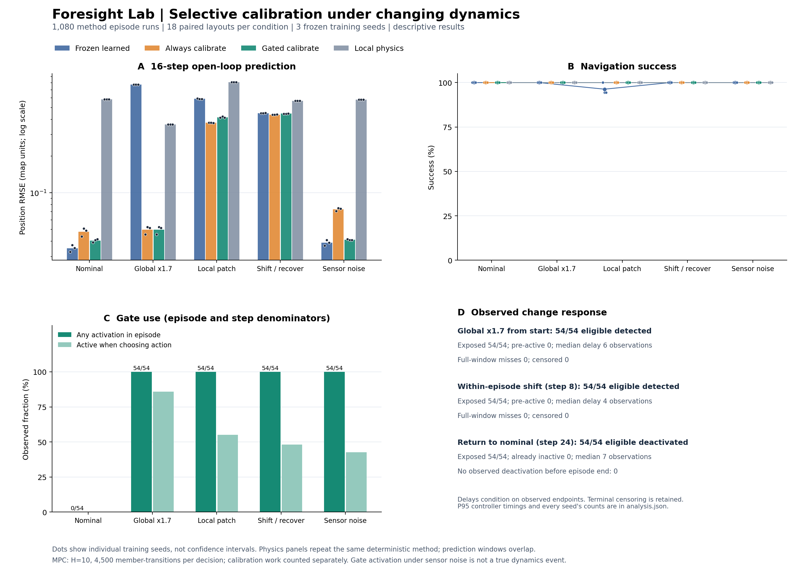
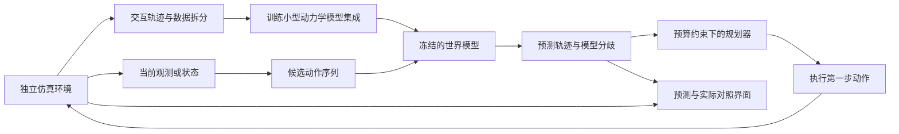

# GraduationProject · 让智能体先看见未来，再行动

> 智能科学与技术本科毕业设计，约 10 周周期。已完成轻量混合世界模型、动态导航规划、真实实验回放与本地在线推理原型。首轮实验已运行，算法改进的有效性仍在验证，不能把工程闭环当作算法创新已经成立。

**最新选题调研（2026-09-17）：**针对“世界模型能力差异要更明显”，建议下一轮优先验证 **对象交互世界模型：预测不同推法的后果，并在值得时先试探、再把物体推入目标姿态**。已核验 Visual Foresight、DINO-WM、主动交互感知、UniWM/NavWM 等论文与公开 PushT 接口，整理了本机自训练方案及 48 小时筛查条件。见[升级方案与论文依据](docs/world-model-upgrade-decision.md)。**这仍是研究建议，新模型尚未训练；下面的运行入口和实验结果属于已经完成的导航原型。**

## 立即运行

项目根目录执行（Python 3.10+）：

```powershell
python -m venv .venv
.\.venv\Scripts\python -m pip install -r requirements-demo.txt
.\.venv\Scripts\python scripts/serve.py
```

打开 **http://127.0.0.1:8765/web/**。仓库包含首轮与三个复核种子的轻量模型，每个约 17KB，无需先训练即可体验。

**推荐先看四路对照：** [http://127.0.0.1:8765/web/compare.html](http://127.0.0.1:8765/web/compare.html)。相同起点、历史和动作序列下，同时比较全局物理参数、局部辨识、冻结学习模型、同一学习模型加校准。彩色预测与白色真实轨迹同步播放，直接显示终点误差；切换“同场景导航”再观察各自规划。旧页面保留自由交互与历史回放。

- **实时推理：**选择方法、场景与阻尼倍率，开始运行；点击地图改变目标。每一步调用真实模型与规划器。门控方法显示“保留先验 / 启用校准”、实际尺度和触发分数。
- **途中改变环境：**运行中暂停，调整阻尼并点击“施加阻尼变化”；保留当前位置与模型历史，继续观察发现失配、校准与重新规划。
- **实验回放：**查看已经记录的候选未来、选中计划和实际执行轨迹。后续实际轨迹包含重新规划，不能直接当成同动作预测误差。
- **实验指标：**来自保存的离线测试，与现场交互分开。

若当前 Python 已安装依赖，直接运行 `python scripts/serve.py`。服务仅监听本机，停止对应终端即可关闭。

## 今天的实验与工作留痕

首轮：**12,993 条训练转移、3 个模型成员、6 种方法、144 个测试回合**。学习模型的 16 步位置 RMSE 从全局常量物理模型的 **0.4792 降至 0.0289**（分布内、160 个留出序列窗口）。

**自适应视野尚未胜出。** 首轮阻尼变化时，自适应成功 10/12，在线物理辨识和固定长视野均为 12/12；这一小样本不支持普遍优劣结论。我们保留失败结果，继续独立训练复核，而不通过隐藏强基线包装“创新”。

[首轮完整分析](docs/day0-findings.md) · [工作记录](docs/worklog.md) · [真实数据](artifacts/day0/summary.json)

**后续已完成：**3 个独立训练运行复核 864 回合，仍未支持原自适应视野假设；再以新场景完成 162 回合的转移校准探索。总计 1,170 个方法运行回合（配对布局重复，不等于 1,170 个独立场景）。校准改善了动力学变化后的预测与控制，但成功率尚未超过局部物理辨识，且原分布预测精度有所下降。见[最新选题判断与下一步](docs/latest-findings.md)。

**最新已完成：**另外 1,080 个方法回合的门控校准复核。整体变化下第 16 步位置 RMSE 从冻结模型的 0.7715 降至 0.0498；原环境门控 0.0406，优于始终校准 0.0480，但不如冻结模型 0.0351。噪声导航 54/54 回合曾误触发，控制成功率尚未优于强物理基线。累计 2,250 个方法回合。[完整结果与适用边界](docs/gated-findings.md)。



复现训练与评估（额外安装 PyTorch、Matplotlib）：

```powershell
.\.venv\Scripts\python -m pip install -r requirements.txt
.\.venv\Scripts\python -m unittest discover -s tests -v
.\.venv\Scripts\python -m foresight.experiment --output artifacts/local-run --episodes 12 --epochs 80 --budget 4500
.\.venv\Scripts\python scripts/replicate.py --episodes 24 --output artifacts/local-replication
```

`artifacts/day0` 是保存的首轮证据，重跑请指定新目录；`scripts/replicate.py` 使用预先规定的 3 个训练种子和新测试面板。模型步预算包含自适应探测开销；实际耗时另行测量。复现详见[运行说明](docs/running.md)。

## 已实现方向：轻量世界模型的在线校准与导航规划

**暂定论文题目：**《面向动力学变化环境的轻量世界模型在线校准与导航规划研究》

**偏工程的题目版本：**《基于轻量世界模型的智能体预测与规划系统设计与实现》

**系统名称：**「预见 · Foresight Lab」。正式论文题目暂定，后续随实验支持的贡献调整。

在一个可交互的二维场景中，智能体需要穿过动态障碍、到达目标。它通过采集到的交互数据学习“采取一个动作后，环境会怎样变化”，在内部预测多条候选行动的未来，再执行选中的第一步，观察真实结果并重新规划。环境采用位置相关的未知运动阻尼，让不同区域的动作响应不同；训练分布内采用固定阻尼场，分布外测试只改变阻尼强度。

观众能够同时看到：

- **实际世界：**智能体当前所在的位置、目标与障碍。
- **预测的未来：**不同动作可能产生的轨迹、预计风险与模型分歧。
- **决策过程：**本次计划往前看多少步、为什么更换路线，以及预测与真实结果的偏差。

答辩时在运动途中改变阻尼，展示机器人从实际反馈中发现失配，再决定是否校准未来预测。固定短/长视野与早期自适应视野保留作为历史对照。差异和改善必须由真实实验得出，也应展示方法失效的场景。

## 导航原型的研究问题

它把“惊艳”落实到**可操纵的未来预测与决策可视化**，把论文贡献落实到**可比较的规划机制与实验**。学到的动力学模型、规划器、评测与演示可以分开实现，适合逐步交付。

核心研究问题是：

> 在相同冻结模型、历史观测权限与规划成员步预算下，何时应启用或停止在线校准，才能保留正常环境的预测精度，并响应动力学变化？额外更新开销有多大？

原“集成分歧自适应视野”假设未得到复核支持。当前考察持续失配门控、迟滞退出与空间先验的组合；模型集成、MPC、残差校准和在线适应已有成熟先例，不能直接宣称原创算法或首次提出。见[相关工作与贡献边界](docs/related-work-adaptation.md)。

### 这里的世界模型是什么

本项目采用控制与强化学习中的定义：**从交互数据学习、以动作为条件、能够预测后续状态的环境模型**。不要求生成高分辨率视频。

```text
当前状态 s_t + 动作 a_t → 学习到的动力学模型 → 下一状态预测 ŝ_(t+1)
```

将模型连续调用，就能预测一个动作序列对应的未来轨迹。规划器利用预测进行选择；仿真器提供数据和真实反馈。两者必须独立，规划器不能偷偷调用仿真器的真实动力学。

**当前实现是混合模型：**3 个小型 MLP 从交互转移学习“位置 → 阻尼”，再结合已知动作积分与障碍反弹规则预测未来。训练未读取真实阻尼场标签，推理不查询真实阻尼场。冻结网络只读取位置；校准器读取最近 5 条有效转移，门控决定是否应用估计尺度。新实验的局部物理辨识使用同样的过滤条件与历史窗口。历史条件神经网络尚未实现。

## 初期选题比较（历史记录）

以下是原型启动时的工程判断，不是实验评分。完整题目、方法与降级方案见[选题比较](docs/topic-options.md)。最新三条世界模型升级路线及推荐顺序以[升级方案](docs/world-model-upgrade-decision.md)为准。

| 方向 | 观众能直观看到什么 | 可写进论文的核心问题 | 资源与风险 | 建议 |
| --- | --- | --- | --- | --- |
| 动态导航世界模型 + 自适应规划 | 多条未来轨迹、临时变化后的重新决策 | 不确定性如何帮助分配规划预算 | 低维模型可从 CPU 起步；需要强基线 | **综合首选** |
| 多文档证据核验与选择性回答 | 点开结论查看原文出处，发现冲突或证据不足 | 核验与拒答能否减少无证据断言 | 算力较轻，评价集建设是核心 | **较稳妥的备选** |
| 视觉游戏世界模型 + 想象规划 | 给出按键后，预测游戏将如何发展 | 长期预测误差如何影响控制 | 更依赖 GPU，画面清晰不等于控制有效 | 10 周内风险较高 |
| 未知物性下的主动交互世界模型 | 先试推判断物性，再把物体推到目标 | 主动探测是否加快对未知物性的适应 | 仿真可做，在线适应增加工作量 | 有控制基础时考虑 |
| 工具智能体提示注入防护 | 恶意文档诱导越权，系统维持原任务 | 防护效果与正常任务完成率如何权衡 | 需攻击测试集和可审计权限机制 | 偏智能体与安全的备选 |
| 校园声音事件识别与未知拒识 | 实时声音时间轴，对陌生声音拒绝误判 | 噪声变化下识别与拒识是否可靠 | 数据许可、域外评测与阈值设计是重点 | 偏感知与实用系统的备选 |

**初期选择规则：**先验证动态导航。随着原型暴露出任务指标饱和、能力差异不明显的问题，现已补充对象交互、遮挡记忆和视觉模型调研；一次只推进一条新主线。

## 推荐系统结构



用户看到的是一个完整的智能体系统；研究工作集中在**世界模型质量、规划机制和评测**。LLM 语言解释、三维渲染、语音控制都不是第一版的必要条件。

## 导航阶段的范围、资源与交付

已确认：**本科、智能科学与技术专业、距离答辩约 10 周**。导师要求使用智能方法并具有创新，没有指定题目格式或算法。本机单卡约 16GB 显存；当前小模型采用 CPU 训练与推理，首轮训练约 9.67 秒、完整实验约 50.40 秒（不含开发安装时间）。模型规模变化后需重新测量。

| 层级 | 交付内容 | 完成标准 |
| --- | --- | --- |
| 最小闭环 | 2D 环境、轨迹采集、学习动力学、固定视野 MPC | 在独立测试场景中完成预测—规划—执行 |
| 论文主体 | 空间动力学先验、选择性校准、预算记录与消融 | 能回答一个明确研究问题，并解释失败案例 |
| 展示增强 | 未来分支、预测/实际叠加、可控环境变化、实验回放 | 演示连接实际模型输出，可追溯到日志 |
| 后续展望 | 局部观测记忆或低分辨率视觉潜空间 | 排除在本轮 10 周交付范围外 |

### 10 周节奏

| 时间 | 验收目标 |
| --- | --- |
| 第 1–2 周 | 跑通环境、数据、学习模型和固定视野 MPC；确认研究必要性 |
| 第 3–4 周 | 固定选择性校准机制，完善强基线、变化检测和可视化 |
| 第 5–6 周 | 完成主实验、关键消融和误差分析，冻结主结果 |
| 第 7–8 周 | 完成展示系统与论文完整初稿，核对图表引用 |
| 第 9–10 周 | 导师反馈修订、PPT、演示备份与答辩预演 |

从第 1 周开始同步写相关工作和实验记录。两周仍未跑通学习模型闭环，就及时缩小范围；不靠最后两周赶完训练和论文。

项目初期不需要购买设备、启动付费训练或训练通用视频世界模型。若没有取得显著提升，仍可如实报告适用边界与负结果，并与导师确认这样的研究范围是否满足毕业要求。

## 文档导航

1. [选题比较：六个方向的题目、卖点与实验](docs/topic-options.md)
2. [主方案：问题定义、模型、规划与阶段安排](docs/research-plan.md)
3. [阅读清单：论文、官方代码与复现门槛](docs/reading-list.md)
4. [演示故事板：三分钟如何讲清楚“预见”](docs/demo-storyboard.md)
5. [决策记录：目前假设与待确定事项](docs/decisions.md)
6. [已运行的首轮实验及失败分析](docs/day0-findings.md)
7. [工作记录与方案变更](docs/worklog.md)
8. [运行、复现与结果目录说明](docs/running.md)
9. [选题判断与历史结果](docs/latest-findings.md)
10. [门控校准测试前协议](docs/gated-protocol.md)
11. [相关工作与贡献边界](docs/related-work-adaptation.md)
12. [门控校准复核：结果、误触发与下一阶段](docs/gated-findings.md)
13. [直观对照：怎么看、证明了什么](docs/comparison-lab.md)
14. [后续研究提案：混合地面准确停车与强基线](docs/next-research-scope.md)
15. [最新升级建议：对象交互、遮挡记忆、视觉世界模型](docs/world-model-upgrade-decision.md)
16. [专项论文调研：对象交互与主动试探](docs/research-interaction-world-models.md)
17. [专项论文调研：遮挡记忆与主动观察](docs/research-memory-world-models.md)
18. [专项论文调研：视觉世界模型与真实算力](docs/research-visual-world-models.md)

## 下一步

门控校准复核已完成，结果见上文。下一轮建议从对象接触任务、参数敏感性检查、小型历史条件动力学模型和强基线开始，用 48 小时开发筛查决定是否投入视觉阶段；具体协议见[升级方案](docs/world-model-upgrade-decision.md)。早期 `research-plan.md` 等文档保留当时计划，实际已实现范围以本 README、工作记录与各批实验协议为准，拟议升级不计入已完成成果。
