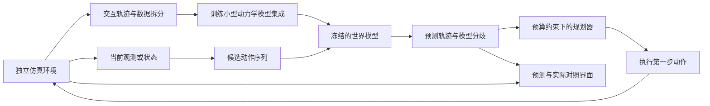

# GraduationProject · 让智能体先看见未来，再行动

> 人工智能毕业论文选题与研究规划。当前为**选题讨论稿**，尚未最终定题；本仓库目前包含研究文档，没有已训练模型、可运行系统或实验成绩。

## 首推方向：面向动态环境的轻量世界模型与自适应规划

**暂定论文题目：**《基于世界模型不确定性估计的动态环境自适应规划方法研究》

**偏工程的题目版本：**《基于轻量世界模型的智能体预测与规划系统设计与实现》

**演示名称：**「预见 · Foresight Lab」——名称仅为毕业设计概念名。

在一个可交互的二维场景中，智能体需要穿过动态障碍、到达目标。它通过采集到的交互数据学习“采取一个动作后，环境会怎样变化”，在内部预测多条候选行动的未来，再执行选中的第一步，观察真实结果并重新规划。环境采用位置相关的未知运动阻尼，让不同区域的动作响应不同；训练分布内采用固定阻尼场，分布外测试只改变阻尼强度。

观众能够同时看到：

- **实际世界：**智能体当前所在的位置、目标与障碍。
- **预测的未来：**不同动作可能产生的轨迹、预计风险与模型分歧。
- **决策过程：**本次计划往前看多少步、为什么更换路线，以及预测与真实结果的偏差。

答辩时改变一个环境动力学参数，例如运动阻尼，展示固定短/长规划视野与自适应规划的行为差异。差异和改善必须由真实实验得出，也应展示方法失效的场景。

## 为什么推荐这个题目

它把“惊艳”落实到**可操纵的未来预测与决策可视化**，把论文贡献落实到**可比较的规划机制与实验**。学到的动力学模型、规划器、评测与演示可以分开实现，适合逐步交付。

核心研究问题是：

> 在相同数据与计算预算下，依据模型预测不确定性调整规划视野，能否改善未知动力学条件下的成功率、碰撞率与决策耗时之间的权衡？

这是待验证的假设。模型集成、MPC（模型预测控制）和不确定性估计都有成熟先例；论文的候选贡献在于具体问题设置、调整机制与严谨验证，不能直接宣称原创算法或首次提出。

### 这里的世界模型是什么

本项目采用控制与强化学习中的定义：**从交互数据学习、以动作为条件、能够预测后续状态的环境模型**。不要求生成高分辨率视频。

```text
当前状态 s_t + 动作 a_t → 学习到的动力学模型 → 下一状态预测 ŝ_(t+1)
```

将模型连续调用，就能预测一个动作序列对应的未来轨迹。规划器利用预测进行选择；仿真器提供数据和真实反馈。两者必须独立，规划器不能偷偷调用仿真器的真实动力学。

第一版使用位置、速度等低维状态，采用 3 个小型 MLP 的集成；正式比较时，模型与物理辨识基线均可使用相同的最近 5 步状态动作历史。10 周主线固定使用完整运动状态，局部观测、GRU 与像素输入只写入展望。

## 备选方向怎么选

以下是工程判断，不是实验评分。完整题目、方法与降级方案见[选题比较](docs/topic-options.md)。

| 方向 | 观众能直观看到什么 | 可写进论文的核心问题 | 资源与风险 | 建议 |
| --- | --- | --- | --- | --- |
| 动态导航世界模型 + 自适应规划 | 多条未来轨迹、临时变化后的重新决策 | 不确定性如何帮助分配规划预算 | 低维模型可从 CPU 起步；需要强基线 | **综合首选** |
| 多文档证据核验与选择性回答 | 点开结论查看原文出处，发现冲突或证据不足 | 核验与拒答能否减少无证据断言 | 算力较轻，评价集建设是核心 | **较稳妥的备选** |
| 视觉游戏世界模型 + 想象规划 | 给出按键后，预测游戏将如何发展 | 长期预测误差如何影响控制 | 更依赖 GPU，画面清晰不等于控制有效 | 10 周内风险较高 |
| 未知物性下的主动交互世界模型 | 先试推判断物性，再把物体推到目标 | 主动探测是否加快对未知物性的适应 | 仿真可做，在线适应增加工作量 | 有控制基础时考虑 |
| 工具智能体提示注入防护 | 恶意文档诱导越权，系统维持原任务 | 防护效果与正常任务完成率如何权衡 | 需攻击测试集和可审计权限机制 | 偏智能体与安全的备选 |
| 校园声音事件识别与未知拒识 | 实时声音时间轴，对陌生声音拒绝误判 | 噪声变化下识别与拒识是否可靠 | 数据许可、域外评测与阈值设计是重点 | 偏感知与实用系统的备选 |

**默认选择规则：**重视研究与展示兼顾，选动态导航；希望更快形成实用产品，选文档证据核验；视觉世界模型保留为高风险备选，不与主线同时开展。

## 推荐系统结构



用户看到的是一个完整的智能体系统；研究工作集中在**世界模型质量、规划机制和评测**。LLM 语言解释、三维渲染、语音控制都不是第一版的必要条件。

## 范围、资源与交付

已确认：**本科、智能科学与技术专业、距离答辩约 10 周**。本机具有单卡约 16GB 显存，暂按单人完成规划；导师要求与个人技术基础仍待确认。算力只是资源条件，训练速度和适配情况需第一周实测。

| 层级 | 交付内容 | 完成标准 |
| --- | --- | --- |
| 最小闭环 | 2D 环境、轨迹采集、学习动力学、固定视野 MPC | 在独立测试场景中完成预测—规划—执行 |
| 论文主体 | 模型不确定性、自适应视野、预算匹配实验与消融 | 能回答一个明确研究问题，并解释失败案例 |
| 展示增强 | 未来分支、预测/实际叠加、可控环境变化、实验回放 | 演示连接实际模型输出，可追溯到日志 |
| 后续展望 | 局部观测记忆或低分辨率视觉潜空间 | 排除在本轮 10 周交付范围外 |

### 10 周节奏

| 时间 | 验收目标 |
| --- | --- |
| 第 1–2 周 | 跑通环境、数据、学习模型和固定视野 MPC；确认研究必要性 |
| 第 3–4 周 | 实现一个自适应视野机制，完善基线与可视化回放 |
| 第 5–6 周 | 完成主实验、关键消融和误差分析，冻结主结果 |
| 第 7–8 周 | 完成展示系统与论文完整初稿，核对图表引用 |
| 第 9–10 周 | 导师反馈修订、PPT、演示备份与答辩预演 |

从第 1 周开始同步写相关工作和实验记录。两周仍未跑通学习模型闭环，就及时缩小范围；不靠最后两周赶完训练和论文。

项目初期不需要购买设备、启动付费训练或训练通用视频世界模型。若没有取得显著提升，仍可如实报告适用边界与负结果，并与导师确认这样的研究范围是否满足毕业要求。

## 文档导航

1. [选题比较：六个方向的题目、卖点与实验](docs/topic-options.md)
2. [主方案：问题定义、模型、规划与阶段安排](docs/research-plan.md)
3. [阅读清单：论文、官方代码与复现门槛](docs/reading-list.md)
4. [演示故事板：三分钟如何讲清楚“预见”](docs/demo-storyboard.md)
5. [决策记录：目前假设与待确定事项](docs/decisions.md)

## 下一步

先向导师确认论文题目和评价要求，再在第一周完成小规模验证：一个环境、一份可复现数据、一个常速度/简单物理基线、一个学习模型、一个固定视野规划器。以这些结果决定是否继续主方案以及是否值得增加视觉输入。

当前阶段上传的是选题与研究规划；以上功能均为计划。正式实验将保留配置、种子、原始结果与失败案例，论文中的数字只来自实际运行。
