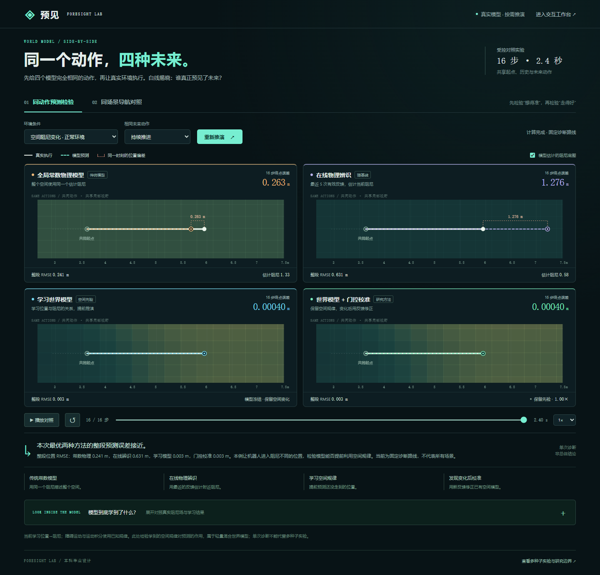

# 四路对照实验台：看清世界模型究竟帮助了什么

用户指出旧界面“有点简单，对比不直观”。这不只是视觉问题：当前模型仅学习位置相关阻尼，而容易的导航任务中多数方法都能成功。本次直接展示同动作预测差异，同时保留各自闭环导航，避免把两种问题混在一条轨迹上解释。

启动 `python scripts/serve.py` 后打开 **http://127.0.0.1:8765/web/compare.html**。原来的在线交互仍在 `/web/`，入口也已加入对照实验台。

## 第一种比较：如果执行同样的动作，谁预测得更准

四个模型观察完全相同的 8 步历史，从同一状态开始预测未来 16 步（2.4 秒）。未来动作事先指定为持续前进、松开驱动或短促制动后滑行。真实仿真器随后执行完全相同的动作序列，期间不重新规划；四个模型在预测时看不到未来转移。

| 面板 | 如何预测 | 要回答的问题 |
| --- | --- | --- |
| 全局物理参数 | 从训练数据拟合一个统一阻尼常数 | 只知道平均规律够不够？ |
| 局部参数辨识 | 最近 5 条有效转移辨识当地阻尼 | 只知道刚经过的地面，能预测下一片区域吗？ |
| 冻结学习模型 | 冻结的神经模型根据位置预测阻尼 | 学到空间规律能否改善跨区域预测？ |
| 学习模型 + 门控校准 | 相同神经模型，加近期历史尺度校准 | 环境整体变化后，校准是否有用？ |

画面坐标范围按所有方法统一确定；同一时刻彩色预测点与白色真实点的距离就是本次位置误差。终点误差是最后执行步的位置距离；轨迹 RMSE 是实际执行区间内各未来步误差的均方根，二者不同。若真实分支提前终止，只评价已经实际执行的前缀，不在终止后继续假装发生了动作。

可以更换动作和原环境/阻尼 ×1.7 条件。整体变化条件在这段共同历史开始前已经生效，校准方法有 8 次观察机会；它不是突然变化检出延迟实验。同动作诊断从固定位置 (2, 4.5)、初速度 (1, 0) 开始共同历史，种子不改变这一预设；种子只用于第二种导航比较。底层阻尼图保持不变，因此不构成跨地图泛化。

## 第二种比较：相同场景，各自决策会怎样

四个方法使用同起点、目标、障碍运动、条件与规划采样种子，独立运行 H=10 的 MPC。同步回放真实模型生成的各自路线，显示结果、步数、最小间距和测得的控制耗时。结果在后端按需生成，相同请求会复用短缓存；浏览器播放速度不是模型实时推理速度。

各自选择的动作可能不同，所以这四条实际路线不能作为第一种比较的“同动作误差”。规划预算同为 4,500 个成员转移；物理模型一个成员、神经模型三个成员，候选数量不同，墙钟耗时也不同。这里展示现有完整控制器表现，不宣称隔离了所有计算因素。

全部到达时就显示全部到达；不为制造差异挑选一个物理方法碰撞、神经方法成功的种子。数据和图层来自实际模型及仿真，页面不内置胜利数值。

## 地面图层来自哪里

评估器可画出真实阻尼场和冻结模型学到的阻尼场，让人检查模型是否记住空间规律。真实场只用于生成仿真反馈与评分/可视化，不进入模型输入、参数拟合或动作选择。障碍运动和积分公式本来已知，不能把图层相似或障碍反弹画面宣称为从零学会整个世界。

## 本次能说明与不能说明的事情

直观对照能解释“物理模型只会外推当前规律，而空间模型还知道接下来区域的规律”这一假设，并让用户用不同动作验证；但具体例子可能相同、甚至学习模型更差，应按实际读数解释。单次诊断图不是独立测试集成绩，过去的主实验结果仍见 [门控复核](gated-findings.md)。

下一步更有价值的是加入同数据训练的空间插值/RBF 基线，并将任务升级为混合地面的准确停车，衡量更准的预测是否帮助选对制动时机。这个提案尚未实现，见 [下一阶段研究范围](next-research-scope.md)。目前可以支持空间先验的收益，尚不能宣称神经网络优于所有空间建模方法。

## 保存与复现

默认固定诊断的全部六个组合均已计算并保存。下表是未来第 16 步的终点误差（米）；这是解释机制的同图诊断，不能当作跨地图盲测或代表性均值。

| 条件与动作 | 全局物理参数 | 局部辨识 | 冻结学习模型 | 门控校准 |
| --- | ---: | ---: | ---: | ---: |
| 正常 · 持续推进 | 0.2626 | 1.2762 | 0.0004 | 0.0004 |
| 正常 · 松开滑行 | 0.3667 | 0.5946 | 0.0069 | 0.0069 |
| 正常 · 制动后滑行 | 0.3574 | 0.4107 | 0.0070 | 0.0070 |
| 阻尼 ×1.7 · 持续推进 | 0.2078 | 0.7293 | 0.6314 | 0.0630 |
| 阻尼 ×1.7 · 松开滑行 | 0.0477 | 0.2318 | 0.3826 | 0.0345 |
| 阻尼 ×1.7 · 制动后滑行 | 0.0693 | 0.1334 | 0.2979 | 0.0247 |

可见冻结学习模型在整体变化后反而可能差于简单全局常数，学习模型并不天然更好。本例能说明的是空间先验与观察后校准各自的作用。正常持续推进的最后一点误差很小，整段轨迹 RMSE 仍为约 0.0034 米，不能称为精确预测。

`python scripts/export_comparison.py --output artifacts/local-comparison-demo` 会导出默认种子 2026 的全部两条件 × 三动作诊断结果，不按表现筛选；包括四方法预测、同动作真实分支、参数图与误差。默认 `artifacts/comparison-demo` 保留本次实际生成的演示证据，不算新增论文测试回合。输出目录已有汇总时拒绝覆盖。

接口是 `POST /api/compare`，`view` 为 `prediction` 或 `navigation`。模型固定为复核种子 142，校准阈值沿用已冻结验证值；不重训、不调整历史实验阈值。
