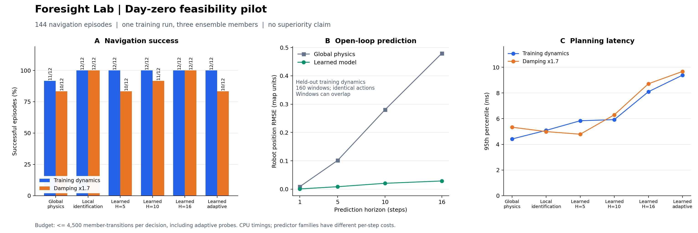

# 首轮可行性实验：系统可继续，创新点需要调整

日期：2026-09-17。本文只分析 `artifacts/day0` 中首次完成的结果；后续独立训练运行应另存目录，不覆盖本轮记录。

**建议继续做这个毕业设计，但暂不把“基于集成不确定性的自适应视野更优”当作已成立结论。** 已训练模型、动作条件未来预测、导航规划、实验记录和实际轨迹回放形成了完整闭环。当前结果支持系统可实现，也支持学习空间变化阻尼能降低分布内预测误差；尚不支持原定自适应视野机制优于合适的固定视野或简单在线辨识。



## 本轮到底做了什么

- **1 次独立训练运行**，随机种子为 42；该运行内部有 3 个集成成员。3 个成员不能记为 3 次独立实验。
- 240 条采集回合，12,993 条训练转移；筛去静止、速度饱和和边界状态后，用 12,490 条转移拟合。另有 50 条验证回合和 50 条预测测试回合，按完整回合分开采集。
- 学习的是 `位置 → 阻尼` 的小型神经网络，再结合已知动作积分、速度限幅和障碍反射运动递推未来。训练目标由观测到的状态转移反推，未读取真实阻尼场标签。这是**混合动力学世界模型**，尚不是从图像学习全部物理过程的通用世界模型。
- 正式导航测试记录共 **144 回合 = 6 种方法 × 2 种动力学条件 × 12 个配对场景种子**。每组包括 4 个 open、4 个 crossing、4 个 slalom 场景。另有 12 个固定视野验证回合，用于在测试前选择固定基线。
- 每次决策最多计算 4,500 个“集成成员 × 候选动作 × 预测步”；自适应方法的探测开销也计入预算。该指标不等于相同耗时，物理模型与神经网络每一步的成本不同。
- 全流程记录耗时 **50.40 秒**，其中训练 **9.67 秒**，均为本机 CPU 实测。该数字不含开发与环境安装时间，不能直接推广到其他硬件。

## 学习模型是否学到了有用东西

在未用于训练的、原动力学分布下的 160 个动作序列窗口上，从同一初始状态出发，按**完全相同的真实动作序列**作开环预测，计算机器人位置 RMSE：

| 预测步数 | 全局常量阻尼物理模型 | 学习阻尼模型 | 本轮 RMSE 相对下降 |
|---|---:|---:|---:|
| 1 | 0.008800 | 0.000789 | 91.03% |
| 5 | 0.101472 | 0.008685 | 91.44% |
| 10 | 0.280156 | 0.020695 | 92.61% |
| 16 | 0.479210 | 0.028923 | 93.96% |

单位为地图长度单位。16 步对应 2.4 秒；这批数据上误差从约 0.479 降至 0.029。结论应写成“本轮分布内留出数据上的误差下降”，不能写成各种未知动力学下均有同等改善。160 个窗口可能来自同一回合且相互重叠，不能当成 160 个独立回合来计算显著性。

常量阻尼基线将训练转移反推出的阻尼取均值，学习模型能够利用空间位置，因此两者差异主要检验**空间变化动力学是否值得建模**。后续应增加按速度能量加权的最小二乘常量模型，以及历史条件模型，检验优势是否仍成立。

## 导航结果是否支持原来的创新点

下表分子为成功回合数，分母为该方法、该条件下的 12 个回合；所有失败均为碰撞，本轮没有超时。

| 方法 | 原动力学成功数 | 阻尼 ×1.7 成功数 | 原动力学规划 P95 | 阻尼 ×1.7 规划 P95 |
|---|---:|---:|---:|---:|
| 全局常量物理模型，H=10 | 11/12 | 10/12 | 4.42 ms | 5.33 ms |
| 最近 5 步在线物理辨识，H=10 | 12/12 | 12/12 | 5.09 ms | 4.99 ms |
| 学习模型，固定 H=5 | 12/12 | 10/12 | 5.84 ms | 4.79 ms |
| 学习模型，固定 H=10 | 12/12 | 11/12 | 5.92 ms | 6.30 ms |
| 学习模型，固定 H=16 | 12/12 | 12/12 | 8.09 ms | 8.71 ms |
| 学习模型，自适应 H | 12/12 | 10/12 | 9.38 ms | 9.67 ms |

固定 H=5 是提前在单独规划验证种子上选出的基线。本轮自适应方法与它在两个条件下的成功/失败配对完全一致，且自适应探测增加了耗时。因此本轮不能声称自适应视野提高成功率，也不能声称它减少延迟。

这不意味着已经证明自适应视野永远无效。当前样本量小、只训练一次、机制也较简单；这里的任务是尽早淘汰没有证据支持的强结论，而不是在测试结果上反复调阈值。

### 对齐到同一个场景看结果

将每种方法在相同环境种子和场景下的结果配对，记录“仅自适应成功”和“仅基线成功”：

| 条件 | 比较基线 | 仅自适应成功 | 仅基线成功 | 两者都成功 | 两者都失败 |
|---|---|---:|---:|---:|---:|
| 原动力学 | 全局常量物理 | 1 | 0 | 11 | 0 |
| 原动力学 | 在线辨识 / 固定 H=5 / H=10 / H=16，各自比较 | 0 | 0 | 12 | 0 |
| 阻尼 ×1.7 | 全局常量物理 | 0 | 0 | 10 | 2 |
| 阻尼 ×1.7 | 在线辨识 | 0 | 2 | 10 | 0 |
| 阻尼 ×1.7 | 固定 H=5 | 0 | 0 | 10 | 2 |
| 阻尼 ×1.7 | 固定 H=10 | 0 | 1 | 10 | 1 |
| 阻尼 ×1.7 | 固定 H=16 | 0 | 2 | 10 | 0 |

阻尼变化时，自适应失败的种子为 20004 和 20010，均是 crossing 场景；在线辨识与固定 H=16 在这两例均成功。这些配对是后续分析具体失败原因的入口，不能把“多成功 2 回合”直接上升为统计显著的普遍优越性。H=16 在测试中更好，也不能据此把它事后替换成“事先选定的唯一基线”。

### 自适应到底选择了多长的未来

| 条件 | H=5 决策次数 | H=10 决策次数 | H=16 决策次数 |
|---|---:|---:|---:|
| 原动力学，共 381 次决策 | 323（84.78%） | 55（14.44%） | 3（0.79%） |
| 阻尼 ×1.7，共 477 次决策 | 390（81.76%） | 71（14.88%） | 16（3.35%） |

当前阈值使大部分决策落到最短视野。阈值来自验证窗口集成分歧的第 65 百分位，数值为 0.004288。验证集中分歧与位置误差的 Pearson 相关系数约为 0.599，但这只是 480 个窗口/视野组合的描述性相关，不能解释成可靠的置信覆盖率，也没有证明对阻尼变化的检测能力。

## 为什么阻尼变了，模型不一定知道自己错了

当前每个模型只根据位置预测阻尼，评估时不接收最近动作与观测转移。同一输入状态、同一候选动作序列送入冻结模型，在原动力学和阻尼 ×1.7 条件下会得到相同的预测与集成分歧。**环境变化并没有通过输入告诉模型。** 随后真实轨迹变化可能间接改变模型访问的位置与速度，但不保证集成成员因此出现更大的分歧。

这说明“集成模型彼此一致”与“模型预测正确”不是同一件事。在线物理辨识基线读取了最近 5 步真实转移，因而具有当前无历史学习模型缺少的信息。本轮它在两类条件都成功，是值得认真对照的强基线。

下一版研究问题可以更具体：**利用近期预测残差识别模型失配，再联合调整预测视野和风险权重，是否比仅用集成分歧更稳健？** 也可以加入历史条件动力学模型。两条路线都要与在线物理辨识比较，并允许最终实验不支持收益。

## 演示中的“预测偏差”必须怎样算

界面里某次规划显示的长预测轨迹，假定继续执行当时选择的整段动作序列。但 MPC 实际只执行第一步，下一时刻会重新规划，后续动作往往改变。因此把旧的 16 步预测路径直接与后来重规划的真实路径相减，混入了**动作变化造成的差异**，不能称为纯模型预测误差。

- **一步误差**：比较当时所选动作预测的下一状态与实际执行后的状态，含义清楚。
- **多步模型误差**：像本轮离线预测评估一样，把日志中真实执行的整段动作输入模型，再与同一段真实状态比较；或在受控测试中锁定动作序列后执行。
- **决策可视化**：可把旧预测轨迹与实际轨迹都显示出来，但应标记“当时计划 / 后续实际轨迹”，解释中途发生了重新规划，不给它贴上模型误差指标。

## 接下来应该怎么决定题目

1. **系统方向继续。** 以“动作条件预测、可解释规划、未知动力学场景、真实实验回放”为演示主线，工程链路已可运行。
2. **题目暂时保留方法空间。** 比“已证明不确定性自适应更优”更稳妥的暂定题目是《面向未知动力学环境的轻量世界模型与自适应规划系统设计与研究》。是否采用残差、历史条件或风险调整，应由接下来的实验决定。
3. **完成多次独立训练与更多配对回合。** 当前模型成员数不能代替训练随机种子数。若后续使用本轮失败案例开发方法，最终论文测试必须换成从未用于选型和调参的场景种子。
4. **先冻结基线与预算，再新增一个机制。** 保留在线辨识强基线，报告延迟与模型步预算，消融“集成分歧、预测残差、两者联合”，避免同时修改模型、奖励、采样和环境后无法归因。

本轮原始数据：[summary.json](../artifacts/day0/summary.json)、[episodes.json](../artifacts/day0/episodes.json)、[prediction.json](../artifacts/day0/prediction.json)。派生配对明细：[analysis.json](../artifacts/day0/analysis.json)。复现本文派生统计与图表：

```powershell
python scripts/analyze_pilot.py --input artifacts/day0
```

该命令只读取已有实验记录并生成派生统计及图表，不重跑训练，也不修改原始记录。
