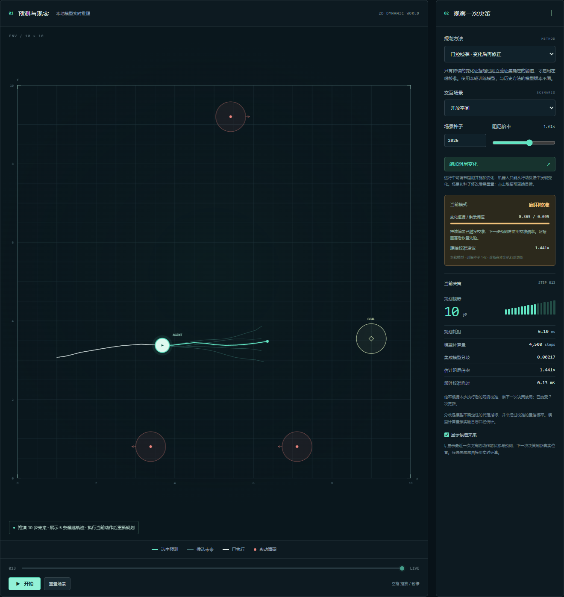

# 门控校准复核：有明确预测收益，也有噪声误触发边界

日期：2026-09-17。**建议继续这个选题，但将主张限定为“轻量混合世界模型的选择性校准与预测保持”。** 本轮支持门控减轻始终校准的名义精度损失，同时保留整体变化下的预测改善；还没有证明更高的导航成功率或通用变化检测能力。

暂定题目：**《面向动力学变化环境的轻量世界模型在线校准与导航规划研究》**。可展示的智能闭环已经具备：学习空间动力学 → 推演候选动作 → 执行 → 根据近期反馈判断是否校准 → 重新规划。在线适应、最小二乘与持续阈值本身已有先例，不能声称全新世界模型或首次在线适应，详见[相关工作](related-work-adaptation.md)。

## 本次实际完成了什么

实现与测试前协议在 Git 提交 `fedac77` 中固定并推送后执行，完整运行 **257.0 秒**。使用此前训练的 142/242/342 三个冻结集成模型，不重新训练、不根据本轮测试选择模型。验证采集 50 回合，共 2,753 转移，其中 2,649 条可用于辨识，每个模型有 2,549 个门控分数；验证阈值分别为 **0.095028、0.112521、0.096396**。

导航：3 训练种子 × 5 条件 × 4 方法 × 18 新配对布局 = **1,080 个方法运行回合**，只有 18 个独立布局。相同确定性物理基线在三个种子循环中重复，除计时外记录完全相同，不能算三份独立训练证据。加上历史批次，项目累计 2,250 个方法运行回合，仍不等于 2,250 个独立场景。

四种方法共用 H=10 与每次 4,500 个成员转移的规划预算。始终校准、门控校准和物理辨识使用相同的有效样本过滤与最近 5 条有效转移；神经模型冻结。校准额外网络查询单独计数。环境的真实变化只供仿真和评分，不传给规划器。

原协议见 [gated-protocol.md](gated-protocol.md)，机器可读协议和代码/模型哈希见 [protocol.json](../artifacts/gated-study/protocol.json)。

## 同动作预测：主要收益与代价

下表是**第 16 步位置 RMSE**，先在每个训练种子的完整窗口上计算 RMSE，再对三个种子取均值。单位为仿真地图单位，越小越好。每次滚动使用同一真实动作序列，期间不获取未来观测。

| 条件 | 冻结学习模型 | 始终校准 | 门控校准 | 匹配历史的物理辨识 |
| --- | ---: | ---: | ---: | ---: |
| 原环境 | **0.0351** | 0.0480 | 0.0406 | 0.5853 |
| 整体阻尼 ×1.7 | 0.7715 | **0.0498** | **0.0498** | 0.3631 |
| 局部阻尼增强 | 0.5892 | **0.3748** | 0.4158 | 0.8070 |
| 途中变化后恢复 | 0.4501 | **0.4380** | 0.4456 | 0.5689 |
| 原环境加传感噪声 | **0.0389** | 0.0732 | 0.0412 | 0.5799 |

- **保留精度有部分效果：**名义条件相对始终校准下降约 15.3%，但仍比冻结模型差，不能写“完全保持原精度”。
- **整体变化后的适应有效：**门控相对冻结模型误差下降约 93.5%，在本批窗口上与始终校准一致。预测窗口从第 8 步起取样，不能用这一相等结果声称两者启动延迟相同。
- **局部变化存在代价：**尺度变化不是全局常数，门控和滞后历史可能延缓有用修正；门控不如始终校准。不能以整体倍率结果代表任意动力学变化。
- **途中变化与恢复改善很小：**开环窗口可能跨越尚未发生、控制器未知的未来突变，因此该误差混合了事件前后阶段，不是“检出后稳态误差”。
- **噪声下需要分开解释：**预测面板中门控接近冻结模型，并显著少于始终校准的误差；闭环导航却出现大量误触发，见下一节。

预测面板每条件生成 24 个行为采样回合；只保留从第 8 步起、每隔 4 步且仍有完整 16 步未来的窗口。实际贡献回合依次为 **18、19、18、19、18**，每种子窗口数依次为 **134、228、183、166、134**。提前碰撞或结束的短回合可能不贡献窗口，短视野指标也使用同一组完整窗口。窗口重叠，不是独立样本；所有方法在同一条件内共享窗口。

逐种子结果（142 / 242 / 342；物理辨识三次重复值见上表及原始文件）：

| 条件 | 方法 | 第 16 步 RMSE，逐训练种子 |
| --- | --- | --- |
| 原环境 | 冻结 | 0.032826 / 0.037280 / 0.035294 |
| 原环境 | 始终 | 0.043827 / 0.050987 / 0.049096 |
| 原环境 | 门控 | 0.039118 / 0.040990 / 0.041735 |
| 整体变化 | 冻结 | 0.773417 / 0.769990 / 0.771211 |
| 整体变化 | 始终与门控 | 0.045638 / 0.052449 / 0.051436 |
| 局部变化 | 冻结 | 0.592266 / 0.587933 / 0.587374 |
| 局部变化 | 始终 | 0.376447 / 0.374749 / 0.373214 |
| 局部变化 | 门控 | 0.413085 / 0.421636 / 0.412681 |
| 变化恢复 | 冻结 | 0.450168 / 0.449202 / 0.450991 |
| 变化恢复 | 始终 | 0.437479 / 0.436590 / 0.440075 |
| 变化恢复 | 门控 | 0.444628 / 0.444786 / 0.447423 |
| 噪声 | 冻结 | 0.036889 / 0.041046 / 0.038897 |
| 噪声 | 始终 | 0.070656 / 0.074897 / 0.073989 |
| 噪声 | 门控 | 0.041712 / 0.041046 / 0.040931 |

## 导航与变化检测：不能只挑好看的结果

导航中，仅冻结模型在局部变化条件下的成功数为 **18/18、17/18、17/18**；其他所有方法与条件均为每个种子 **18/18**。样本很小且成功率接近上限，**没有证据表明门控优于强物理辨识或始终校准的控制表现**。不能把预测误差改善直接改写成导航能力提升。

名义导航门控 **0/54** 回合曾触发；但另一组行为采样的名义预测面板有 **7/402** 个窗口触发（逐种子 3/134、1/134、3/134）。不同采样策略访问的状态和速度不同，名义导航零触发不能推导为所有轨迹零误报，也不能推导为原精度完全保持。

噪声导航在动力学没有变化时，**54/54** 回合都曾触发，选择动作前有 **42.64%** 的步骤处于校准状态；独立预测面板却只有 **7/402** 个窗口触发。这两套轨迹必须分别报告。当前用无噪声验证数据设阈值，速度噪声可能被解释为动力学参数变化；这里是明确失败边界，不能把门控当作可靠的变化概率。

| 事件 | 符合统计条件的回合 | 观察到目标事件 | 延迟中位数 | P95 |
| --- | ---: | ---: | ---: | ---: |
| 开局即整体 ×1.7，首次启用 | 54 | 54 | 6 次观察 | 6 |
| 第 8 次转移开始 ×1.7，首次启用 | 54 | 54 | 4 次观察 | 9 |
| 第 24 次转移恢复，退出校准 | 54 | 54 | 7 次观察 | 7 |

以上均实际经历了事件；没有变化前已启用、完整变化区间未检出或提前结束而无法观察到检出/退出的回合。退出统计要求恢复前仍处于启用状态。延迟按接收到的转移观察次数计；步长 0.15 对应仿真时间，不是墙钟检测耗时。记录与删失处理见 [detection.json](../artifacts/gated-study/detection.json) 和 [analysis.json](../artifacts/gated-study/analysis.json)。名义验证窗口 99% 分位数从来不代表整局误报率只有 1%。

本轮各方法/条件的控制器 P95 为 **4.13–7.48 ms**，包括外围计时的 `planner.act()` 和模型观察更新，不含仿真、网络和前端绘制。所有方法均用满 4,500 个规划成员步；有效观察额外消耗 3 次小网络位置预测。物理方法有一个成员、神经方法有三个，因此相同成员步预算也不等于相同候选数、相同耗时。运行顺序和机器负载也会影响计时，本轮没有按墙钟预算重新优化方法。

## 系统已经能怎样展示

[启动方法](running.md)：选择“门控校准”，open 场景、种子 2026、倍率 1.0；第 8 步暂停，设倍率 1.7 并点击“施加阻尼变化”，继续运行。实际浏览器测试中，第 8 步分数约 0.024，低于阈值 0.095；第 13 步启用校准，分数约 0.365、尺度约 1.441。施加变化没有重置位置或历史。

界面诊断在本步执行后更新，供下一次决策使用；显示的候选轨迹是本次执行前算出的预测，界面已标注这一时序。不同实时方法可能来自不同历史模型版本，正式公平比较使用本轮四方法面板，不能直接拿现场不同模型当消融结论。

测试：52 项 Python 测试中 51 项通过，1 项因 Windows 符号链接夹具权限跳过；Edge 检查覆盖真实推理、途中变化、门控启用、目标修改、桌面和手机，无 JavaScript 异常或横向溢出。分析脚本复算全部计数、误差与检测事件，与原始记录一致。

## 下一阶段，只补两项关键证据

1. **持续性和退出机制消融。** 比较单次阈值、连续触发、去掉迟滞退出。固定已训练模型，阈值仍由新验证数据决定，另留新布局测试；回答效果究竟来自哪一部分，而不是继续堆系统功能。
2. **噪声与可辨识性。** 检查按速度能量或估计方差归一化的失配分数，加入覆盖噪声的验证条件；冻结噪声强度与变化速度后测试误报—检测延迟取舍。先作为待验证设计，不在已看过的测试面板上反复挑阈值。

同时按事件分段检查一步及多步误差，避免把跨未知未来突变的误差当成适应后误差。当前系统已可演示，论文机制有可测信号；“创新性成立”和“控制普遍更优”仍未证实。

## 图表与复现

[图表 PDF](../artifacts/gated-study/overview.pdf) · [全部指标](../artifacts/gated-study/summary.json) · [逐窗口原始误差](../artifacts/gated-study/prediction-windows.json) · [验证阈值](../artifacts/gated-study/calibration.json)。复现命令见 [running.md](running.md)。

原始 `replays.json` 的门控状态与尺度来自动作前，但门控分数来自动作后。该展示字段时序问题不影响任何实验指标，原文件保持不变；`scripts/align_gate_replay.py` 派生 [replays-aligned.json](../artifacts/gated-study/replays-aligned.json)，将动作后分数保留为 `gate_score_after` 并对齐动作前分数，记录原文件 SHA-256。后续运行脚本已直接输出两个时序字段。这是运行后展示修复，没有更改模型、阈值、动作或评分。
