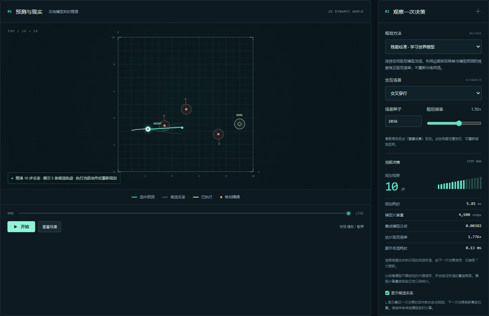

# 选题判断与历史实验记录

**本页下文保存前三批实验的判断。后续已完成 1,080 回合门控复核，最新结论见 [门控校准复核报告](gated-findings.md)。** 门控部分恢复名义预测精度并保留整体变化后的适应收益，但存在噪声误触发，未证明更高的导航成功率。

日期：2026-09-17。已完成可运行系统、首轮试验、3 次独立训练复核，以及一项后续机制探索。下面的判断来自保存的结果，不表示论文创新性已通过文献验证。

## 建议

**继续“机器人预见未来”的系统方向。暂不将“集成分歧驱动自适应视野”定为唯一论文贡献，优先研究“学习的空间动力学先验 + 近期转移校准”。**

更稳妥的暂定题目：**《面向动力学变化环境的轻量世界模型在线校准与导航规划研究》**。工程版可用《基于轻量世界模型的智能导航与可视化系统设计与实现》。在线校准是已有方法家族，本项目目前是具体设计与实验探索，不能宣称首次提出。

## 已经完成的三批验证

| 批次 | 设计 | 已运行回合 | 作用 |
| --- | --- | ---: | --- |
| 首轮 | 1 次独立训练，6 方法 × 2 条件 × 12 配对场景 | 144 | 最小可行性与故障发现 |
| 复核 | 3 次独立训练，6 方法 × 2 条件 × 24 新配对场景 | 864 | 检查训练随机性，未因首轮结果改变超参数 |
| 校准探索 | 冻结首轮模型，3 方法 × 3 条件 × 18 新配对场景 | 162 | 只增加近期转移校准，固定 H=10 |

合计 **1,170 个方法运行回合**，不含训练数据采集、规划器验证和界面交互。三个批次分别只有 12、24、18 个配对布局；重复方法、动力学条件和训练种子不能被当作更多独立环境布局。复核的确定性物理基线重复运行也不构成新的独立证据。

## 原来的自适应视野假设未获支持

复核中，三个独立训练运行均在训练分布内的 24 个回合全部成功，说明当前场景存在明显的成功率上限效应。阻尼乘以 1.7 后：

| 方法 | 训练种子 142 | 训练种子 242 | 训练种子 342 |
| --- | ---: | ---: | ---: |
| 局部物理辨识 | 24/24 | 24/24 | 24/24 |
| 固定 H=5（验证集选出） | 23/24 | 23/24 | 23/24 |
| 固定 H=10 | 23/24 | 23/24 | 23/24 |
| 固定 H=16 | 23/24 | 23/24 | 23/24 |
| 集成分歧自适应 H | 22/24 | 22/24 | 23/24 |

固定模型仅根据位置预测阻尼，在同一位置无法识别隐藏的倍率变化。模型彼此一致不表示它们正确。因此不再通过调阈值来追求本批测试得分；将其作为失败机制保留。

## 新探索：用实际转移校准学到的模型

冻结神经网络权重，保留它学到的空间结构。通过最近 5 条**有效**状态转移估计一个乘法校准系数，修正整个学到的阻尼场；过滤低速、限速与贴墙转移。只读取机器人实际经历的状态和动作，不读取真实阻尼倍率。校准与物理辨识使用相同类别的历史信息，但具体过滤阈值略有不同，后续公平消融需统一。

这一探索保持固定 H=10，避免把校准和视野调整同时混入结果。所有方法有 4,500 个规划成员步预算；校准额外消耗每次有效观测 3 次小网络位置预测，另记账，并把更新时间计入该批控制器耗时。

| 方法 | 原分布 | 阻尼 ×1.7 | 阻尼 ×2.2 |
| --- | ---: | ---: | ---: |
| 冻结学习模型 | 18/18 | 15/18 | 17/18 |
| 学习模型 + 转移校准 | 18/18 | 18/18 | 18/18 |
| 局部物理辨识 | 18/18 | 18/18 | 18/18 |

在另一组采集回合中，用 5 条历史转移适应后，固定后续 16 步真实动作序列测量位置 RMSE（每条件 60 个窗口）：

| 方法 | 原分布 | 阻尼 ×1.7 | 阻尼 ×2.2 |
| --- | ---: | ---: | ---: |
| 冻结学习模型 | 0.0308 | 0.7118 | 1.0251 |
| 学习模型 + 转移校准 | 0.0855 | 0.0657 | 0.0418 |
| 局部物理辨识 | 0.4681 | 0.3301 | 0.2717 |

**值得继续的信号：**在这批空间阻尼变化场景中，学习模型保留空间结构、近期转移修正尺度，长期预测优于只外推一个局部常数的物理辨识；动力学变化后也比冻结模型更准确。

**不能忽略的代价：**校准损害了原分布下的预测精度（0.0308 → 0.0855）；控制成功率还未超过物理辨识；当前变换恰好是整体乘法缩放，结构有利于乘法校准，不能据此声称适应任意环境。探索只有一个冻结训练模型，样本量仍小，未证明统计显著性或方法原创性。

## 后续最有价值的两项工作

1. **研究何时应该校准。** 在训练分布内保持空间先验，在观测到持续预测失配时启用校准，检验能否同时降低“无变化时被错误修正”和“变化后不适应”的代价。只新增一个门控机制，与始终校准、从不校准、局部辨识比较。
2. **检验机制边界。** 预先划定新测试面板，加入非整体缩放的空间局部变化与观测噪声，统一各方法历史窗口和过滤条件，增加多训练种子，并比较同延迟预算下的效果。先检索残差动力学、在线系统辨识、上下文世界模型等近邻研究，明确本科论文能主张的贡献范围。

系统展示继续强化“预测—执行—发现偏差—校准—重新规划”，而不是添加与研究无关的功能。今天的小系统已经具备演示价值；论文是否“有创新”仍取决于上述差异、消融与导师认可。

## 证据入口

- [首轮分析](day0-findings.md)
- [三次独立训练复核](../artifacts/replication/summary.json)
- [校准探索协议与结果](../artifacts/residual-probe/summary.json)
- [校准探索每局记录](../artifacts/residual-probe/episodes.json)
- [系统运行方法](running.md)

实际界面（在线校准与规划，所示离线成绩仍为首轮基线实验）：

