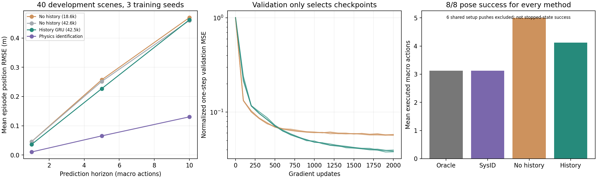

# 接触推物首轮：模型能学会，但长期推演和主动决策仍待突破

2026-09-17。本轮已经真实采集数据、自训练模型、运行开发评估并完成回放页面。结论：**对象接触世界模型的工程闭环可行；交互历史有短期预测价值，目前没有强基线面前的巨大性能优势。** 尚未实现选择性主动试探，也未训练视觉模型。

## 直接体验

启动原有 `python scripts/serve.py`，访问 [推物试验台](http://127.0.0.1:8765/web/pushing.html)。页面包括：

- 同一真实状态下，从四个不同侧面推动，展示模型预测与独立仿真实际结果。固定开发场景 0/1，未筛选胜出案例。
- 无历史模型、有历史模型、在线物理辨识对同一未来动作序列的预测。提供固定首例及历史模型位置误差最大例，支持同步拖动。
- 四种方法从同一起点向同一目标位姿规划的真实回放。固定首例恰好各方法动作相同，如实展示。
- 完整开发集的预测汇总，以及相近参数量的无历史网络对照。

这是**预测对象状态的渲染**，不是神经视频生成。每次宏动作可重定位推杆，不模拟机械臂绕行；帧间动画是端点插值，不作为接触物理证据。当前也没有禁区或避障任务。

## 已完成的实验

训练 1,200 回合×20 步 = **24,000 条转移**；验证 120 回合；开发筛查 40 回合，前 20 个参数范围内、后 20 个为保留的阻尼/质心范围。每回合物性固定，整回合拆分，训练不读物性标签。训练转移接触率为 92.36%。数据生成约 5.40 秒。

首轮无历史 MLP 18,566 参数，历史 GRU + MLP 42,502 参数，分别训练种子 17/29/43、各 2,000 次更新。追加同容量无历史 MLP 42,576 参数、同样三个种子，排除只因网络更大的解释。总计 **9 个独立训练模型**，每模型仅根据验证误差选权重；追加容量对照属于开发后的补充分析。

这些模型比选题阶段预计的 1–3M 更小：先用局部坐标不变性和宏动作状态预测验证任务。首轮六模型 GPU 训练记录约 39.56 秒；首次模型计时包含约 16 秒运行库初始化，后续单个训练约 3–5 秒。追加三模型约 25 秒，其中首次也包含初始化。记录的峰值张量分配约 32–104MB，**不包含驱动/运行库全部显存占用**，不能当作完整显存需求。详见 [训练日志](../artifacts/pushing-pilot/training.json)。

## 预测结果

表中每项先计算每回合各视野内位置 RMSE，再对场景和三个训练种子平均；单位米。物理基线只运行一次，不伪造三个训练种子。40 个独立场景不因重复模型评估而增加。

| 方法 | 1 步（0.5s） | 5 步（2.5s） | 10 步（5s） |
|---|---:|---:|---:|
| 无历史 MLP，18.6k 参数 | 0.0458 | 0.2573 | 0.4701 |
| 无历史 MLP，42.6k 参数 | 0.0455 | 0.2515 | 0.4603 |
| **历史 GRU，42.5k 参数** | **0.0361** | **0.2269** | **0.4624** |
| 历史 GRU，提供另一回合的错误历史 | 0.0637 | 0.3553 | 0.6655 |
| 在线物理辨识 | 0.0103 | 0.0653 | 0.1304 |
| 静止预测 | 0.3011 | 0.6633 | 0.9516 |
| 匀速外推 | 0.2792 | 0.8744 | 1.5685 |

相对同容量无历史模型，历史模型一步位置误差降低 **20.6%**，五步降低 **9.8%**，十步反而高 **0.5%**。按场景配对、对三个种子先平均的探索性 bootstrap，一步差值为 −0.0094m，95% 区间 [−0.0159, −0.0030]；五步与十步区间跨零。此区间仅覆盖开发场景抽样，不完整覆盖训练随机性，不能宣称确认性检验通过。

错配历史明显变差，说明模型确实使用了历史；但长期连续展开仍容易积累位置和角度误差。所有神经模型只做一步监督，多步训练尚未加入。改变推动侧面的检查中，预测与真实位移方向平均余弦相似度约 0.995（固定 8 个开发状态、每状态 4 动作），支持动作输入确实影响正确的运动方向，不表示全部接触细节已经准确。

强物理辨识知道公开模拟器结构，从同样 6 次历史拟合未知参数，不读取真实参数。它在这个已知结构的小任务里更准确，这是实际结果，不从对照中删去。



## 基础闭环规划

固定 8 个开发场景（4 分布内、4 范围外），神经规划只使用预先指定的种子 17。每次决策所有方法都评估 252 次模型转移，最多执行 12 次宏动作，另有相同 6 次前置历史推动。物理辨识额外拟合成本单独记录；候选数相同不意味着计算量或时间相同。

| 方法 | 目标位姿达标 | 平均执行宏动作数 | 决策耗时中位数 |
|---|---:|---:|---:|
| 真实参数参考 | 8/8 | 3.125 | 43.70ms |
| 在线物理辨识 | 8/8 | 3.125 | 160.25ms |
| 无历史模型 | 8/8 | 5.000 | 0.57ms |
| 历史模型 | 8/8 | 4.125 | 2.00ms |

“达标”只要求某个宏步终点位置误差 <0.08m、角度误差 <0.18rad，**未要求停止或持续保持**。这 8 个简单目标都达到指标，无法证明成功率差异。历史模型少用了一些动作，但仍多于物理辨识；当前学习模型的实测优势主要是候选预测速度。该速度比较受当前 Pymunk Python 实现与批量神经推理影响，不能推广为学习模型总是更快。

## 下一阶段是否值得做

**值得继续一个有限阶段，但暂不升级为完整视觉系统或宣称创新已成立。** 已解决的风险是：真实接触数据可生成；小模型可自主训练；动作条件正确；历史影响预测；学习模型能支持规划。尚未解决的是：长期推演显著漂移、基础目标太容易、主动试探没有实现。

最紧接的技术实验应使用多步训练目标，降低接触和旋转误差的累积，并在包含精确姿态/停稳要求的新开发任务上重新检验。若采用“何时试探”的研究点，还必须从零历史开始，比较固定试探、被动适应和任务相关试探，限制总动作预算；当前共享 6 步历史不构成主动试探实验。不能通过专门让物理基线失效来制造创新差距。

首轮并未达到先前希望的十步历史误差降低约 25% 门槛。与其立即堆叠大模型，下一步应先检验多步训练是否解决这个明确短板。公开 PushT、真实图像输入、多物体与禁区都未在这一轮完成。

## 复现与检查

已有页面只需 `requirements-demo.txt`。运行新训练及全部测试需安装：

```powershell
python -m pip install -r requirements-pushing.txt
python -m unittest discover -s tests -v
python scripts/pushing_pilot.py generate
python scripts/pushing_pilot.py train
python scripts/pushing_pilot.py evaluate
python scripts/pushing_pilot.py planning
python scripts/pushing_pilot.py train --matched
python scripts/pushing_pilot.py matched_evaluate
```

默认输出 `artifacts/local-pushing-run`，数据与 checkpoint 使用对应目录名，避免覆盖已发布证据。再次实验指定新的 `--output artifacts/my-run-02`；所有阶段保持同一个路径。训练耗时、权重逐字节一致性不作保证；固定种子和验证选择规则可重复实验过程。

发布的 `.npz` 是无 pickle 的可移植参数，可直接 `PushWorldModel.load('artifacts/pushing-pilot/history-17.npz')`，无须下载 `.pt`。数据可按协议重新生成，哈希记录在 [manifest.json](../artifacts/pushing-pilot/manifest.json)。

本轮统一检查 79 项，78 通过、1 Windows 符号链接夹具权限跳过；包含未来泄露、回合边界、历史截止点、坐标等变、物理接触、辨识泛化和权重恢复。`scripts/analyze_pushing.py` 核对数据/权重哈希、全部回放位置误差与规划成功条件，生成图表与[审计记录](../artifacts/pushing-pilot/audit.json)。网页经 Edge 桌面和 390px 手机验证：回放、切场景、时间轴和全部画布正常，无页面异常与横向溢出。

原始结果：[预测](../artifacts/pushing-pilot/prediction.json)、[容量匹配预测](../artifacts/pushing-pilot/matched-prediction.json)、[规划](../artifacts/pushing-pilot/planning.json)、[全部诊断案例](../artifacts/pushing-pilot/all_cases.json)。初始协议与实现在运行前提交为 `bde9e25`。
